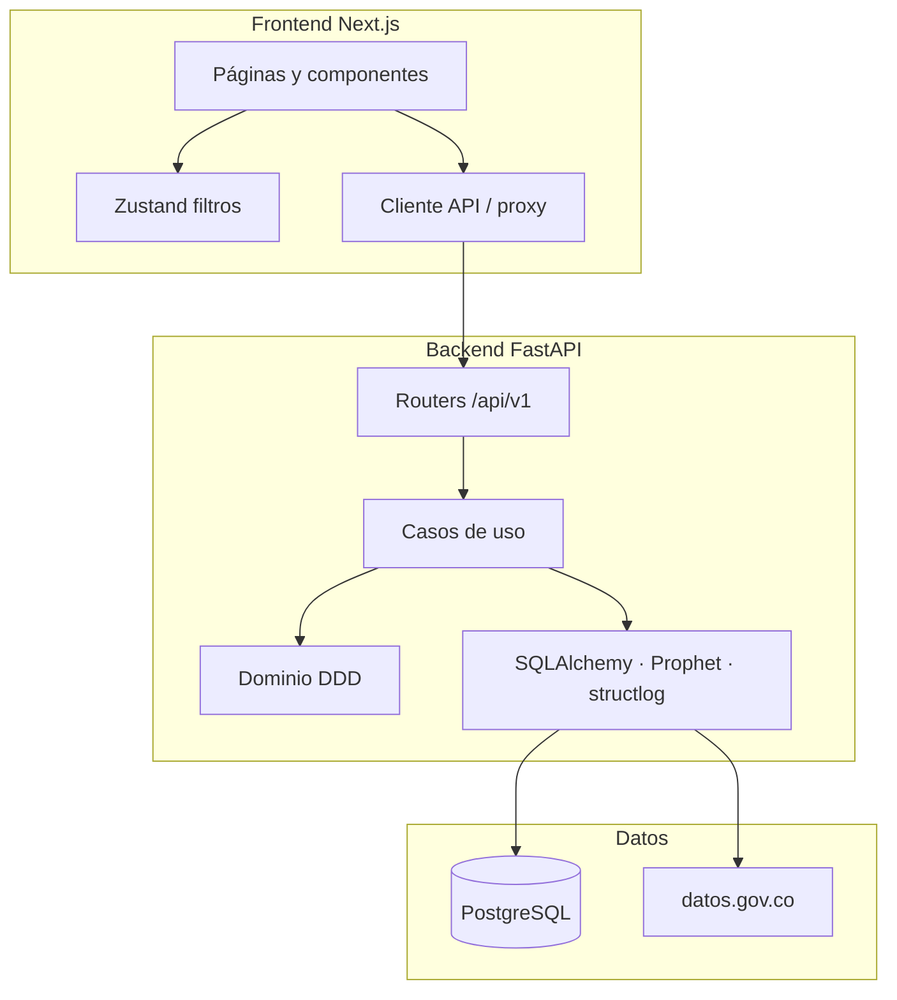

# Arquitectura técnica (MVP)

Visión de alto nivel alineada con [`AGENTS.md`](../AGENTS.md).

## Capas

## Bounded contexts

| Contexto | Responsabilidad |
|----------|-----------------|
| EpidemiologicalSurveillance | Ingestión, frescura, calidad de datos |
| HealthIndicators | Lectura de observaciones curadas |
| TerritorialRisk | Score, persistencia, mapa de riesgo |
| AnomalyDetection | Alertas vs mediana del periodo |
| PredictionEngine | Tendencias y forecast |
| InsightsGeneration | Narrativa explicable |

## Persistencia

- Observaciones curadas: `health_indicator_observations`
- Trazabilidad: `ingestion_runs`, `data_sources`
- Scores auditables: `territorial_risk_scores`

## Operación

- Logs estructurados (`structlog`) por request
- Métricas Prometheus-lite en `GET /metrics`
- Rate limit configurable (`RATE_LIMIT_PER_MINUTE`)
- Headers de seguridad HTTP básicos

## ML

- **Serving:** reglas explicables + Prophet con fallback lineal
- **Entrenamiento offline:** `backend/ml/train_mortality_experiment.py`
- Evaluación: [`ml-evaluation.md`](ml-evaluation.md)
