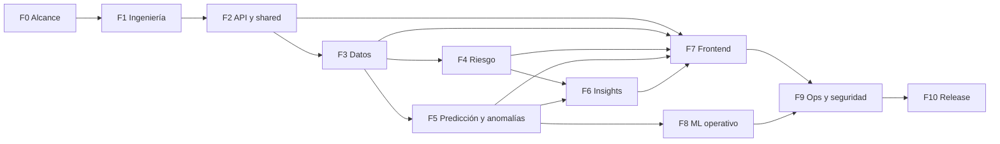

# Roadmap de implementación

**Plataforma de Inteligencia Epidemiológica Territorial**

Este documento describe las **fases** recomendadas hasta tener el proyecto **funcionando de extremo a extremo** según el alcance de [`AGENTS.md`](../AGENTS.md): API REST versionada (`/api/v1`), bounded contexts, frontend Next.js, PostgreSQL, Docker, machine learning explicable y principios DDD / Clean Architecture.

**Qué significa aquí “100 % funcionando”.** Un **producto mínimo institucional completo**: datos reales fluyen hacia Postgres, indicadores y riesgo son consultables vía API, existen tendencias / anomalías / insights con trazabilidad y límites de uso explícitos, la interfaz permite explorar lo anterior, el despliegue es reproducible y hay una base mínima de calidad, observabilidad y documentación. No implica cobertura exhaustiva de todas las fuentes del país ni sustituir validación epidemiológica o decisiones políticas.

**Referencias:** metodología de ciclo de vida ML en [`docs/crisp-ml.md`](crisp-ml.md); reglas de arquitectura y stack en [`AGENTS.md`](../AGENTS.md).

---

## Estado actual (línea base)

- **F0–F3:** MVP documentado, ingestión real datos.gov.co, validación DIVIPOLA en ingestión, worker programado Docker, API de indicadores.
- **F4–F6:** Riesgo persistente y explicable, anomalías, tendencias (Prophet + fallback), insights narrativos con contexto de sistema.
- **F7:** Frontend Next.js (indicadores, mapa Leaflet, riesgo, anomalías, tendencias, insights, frescura de datos).
- **F8 (parcial):** script offline de experimento ML + `docs/ml-evaluation.md`.
- **F9 (parcial):** structlog, `/metrics`, rate limit, `/data-quality`, headers de seguridad.
- **F10 (parcial):** `docs/user-guide.md`, `docs/architecture.md`, `docs/runbook-release.md`, `docs/DESIGN.md`.
- **Pendiente:** release etiquetada en remoto, E2E Playwright, SHAP en serving, backups automatizados.

Ver también [`post-mvp-roadmap.md`](post-mvp-roadmap.md).

---

## Fase 0 — Definición de producto y límites

**Objetivo:** alinear criterio de “terminado” entre equipo y stakeholders.

**Actividades:**

- Definir **MVP institucional**: nivel geográfico, ventana temporal, fuentes de datos abiertas prioritarias, significado operativo de “riesgo” y límites (no decisión clínica automática, no caja negra).
- Matriz de **prioridades** por bounded context y por endpoint.
- **Criterios de aceptación** por vertical (dato → caso de uso → API → UI).
- Consolidar **lenguaje ubicuo** (entidades y nombres de API alineados al dominio).

**Entregables:** documento breve de alcance + backlog priorizado (sin obligar implementación inmediata de todo el alcance).

---

## Fase 1 — Cimentación de ingeniería

**Objetivo:** que el desarrollo posterior sea reproducible y revisable.

**Actividades:**

- Estructura de monorepo estable (`backend/`, `frontend/` cuando exista), convenciones de ramas y mensajes de commit.
- **CI:** lint, tests unitarios del backend (y del frontend cuando exista), build de imagen Docker en rama principal.
- Herramientas de calidad Python (p. ej. Ruff, mypy opcional), política estricta de **migraciones Alembic** en cada cambio de esquema.
- Gestión de **secretos** (variables de entorno, nunca credenciales en imagen).
- **OpenAPI** como contrato revisable en PR.

**Entregables:** pipeline CI verde, plantilla de PR, reglas de migración documentadas en `README` o aquí si se amplía.

---

## Fase 2 — Contratos API y núcleo compartido

**Objetivo:** superficie API completa en **forma**, sin depender aún de toda la lógica de negocio.

**Actividades:**

- Extender **SharedKernel** (tipos comunes: periodos, códigos territoriales, paginación, errores).
- Routers `/api/v1` para todos los recursos previstos en `AGENTS.md`, con respuestas **stub** fuertemente tipadas hasta sustituir por implementación real:
  - `health-indicators` (ya con persistencia mínima),
  - `predict-risk`,
  - `anomalies`,
  - `territorial-trends`,
  - `insights`.
- Modelo de **errores** HTTP coherente (validación 422, no encontrado 404, indisponibilidad 503).

**Entregables:** OpenAPI que describe el producto objetivo; implementación real por fases posteriores.

---

## Fase 3 — Datos: catálogo, ingestión y EpidemiologicalSurveillance

**Objetivo:** datos **curados y trazables** en PostgreSQL.

**Actividades:**

- **Catálogo de fuentes** (proveniencia, licencia, granularidad, frecuencia de actualización).
- **Ingestión batch** (CLI o job): extracción, normalización, validación, carga idempotente.
- Esquema relacional alineado al dominio (crudos vs curados, indicadores, metadatos de corrida).
- **Validaciones** de integridad territorial/temporal y reglas de negocio acordadas.
- Casos de uso en `application/`; repositorios y clientes en `infrastructure/`; **sin SQL ni reglas de negocio en routers**.

**Entregables:** al menos **una fuente real** integrada de punta a punta con linaje documentado.

---

## Fase 4 — TerritorialRisk

**Objetivo:** **scoring de riesgo territorial** reproducible y auditable.

**Actividades:**

- Modelo de dominio (`RiskScore`, umbrales, clasificación territorial).
- Persistencia de resultados por territorio y periodo (si el diseño lo requiere).
- Implementación del endpoint de riesgo (p. ej. `predict-risk` o el nombre acordado en contrato): entrada (territorio, periodo), salida con score, versión de reglas/modelo y supuestos.
- Separar **reglas versionables** de componentes ML cuando el riesgo combine ambos.

**Entregables:** riesgo calculable desde datos curados, con trazabilidad de versión.

---

## Fase 5 — PredictionEngine y AnomalyDetection

**Objetivo:** tendencias y alertas **asistidas**, acordes a capacidad de revisión humana.

**Actividades:**

- `territorial-trends`: agregaciones temporales, pronóstico acotado (p. ej. Prophet) con supuestos documentados.
- `anomalies`: detección con baseline y umbrales; volumen de alertas acorde a revisión manual.
- Pipelines ML como **infraestructura**; versionado de datasets, features y artefactos (ver `docs/crisp-ml.md`).
- **Explicabilidad** (p. ej. SHAP donde aplique) con advertencias sobre correlación vs causalidad.

**Entregables:** endpoints funcionales con **evaluación documentada** (métricas, validación temporal, análisis básico de sesgos).

---

## Fase 6 — InsightsGeneration

**Objetivo:** narrativa analítica alineada con API y dominio.

**Actividades:**

- `insights`: plantillas de narrativa + datos que alimentan comparaciones, drivers e incertidumbre.
- Diferenciar **explicación del modelo** y **explicación del sistema** (versión de datos, ventana, fuentes).

**Entregables:** insights consumibles por el frontend y comprensibles para audiencia no técnica.

---

## Fase 7 — Frontend (Next.js)

**Objetivo:** producto **usable** e institucional.

**Actividades:**

- Aplicación Next.js + TypeScript + Tailwind + shadcn/ui según `AGENTS.md`.
- Layout, navegación por capacidades (indicadores, mapa, riesgo, tendencias, alertas, insights).
- Cliente API tipado (generación desde OpenAPI o tipos manuales coherentes).
- **Leaflet** (mapas) y **Apache ECharts** (series); estado con Zustand donde corresponda; **Framer Motion** opcional y acotado.
- Estados vacíos, errores y “última actualización de datos” visibles.

**Entregables:** un **vertical slice** por cada gran capacidad hasta cubrir los cinco focos de API.

---

## Fase 8 — ML operativo y reproducibilidad

**Objetivo:** cerrar el ciclo **entrenar → evaluar → registrar → desplegar**.

**Actividades:**

- Entornos de entrenamiento reproducibles (imagen Docker o lockfile, semillas, registro de experimentos).
- Separación estricta **entrenamiento / serving**; contrato de features versionado.
- Política de **rollback** de modelo y convivencia de versiones en despliegue.

**Entregables:** runbook de promoción de modelo y de rollback.

---

## Fase 9 — Observabilidad, seguridad y operación

**Objetivo:** sostenibilidad en **producción**.

**Actividades:**

- Logs estructurados, métricas (latencia, errores), trazas si se adoptan.
- Monitoreo mínimo de **calidad de datos** y **drift** (diseño + primera implementación acotada).
- Seguridad: headers, límites de tasa si la API es pública, autenticación/autorización si el contexto lo exige.
- Backups de PostgreSQL, prueba de restauración, runbooks (fallo de DB, migración fallida).

**Entregables:** checklist de go-live y responsables.

---

## Fase 10 — Cierre de release “100 %”

**Objetivo:** hito explícito de producto **versionado** y demostrable.

**Actividades:**

- Documentación de usuario breve + documentación técnica (arquitectura, datos, modelos).
- Demo institucional (guión y datos).
- Definition of Done global: CI verde, migraciones aplicables, OpenAPI actualizado, smoke tests (E2E opcional, p. ej. Playwright).
- Roadmap post-MVP (nuevas fuentes, granularidad, integración institucional).

**Entregables:** **release** etiquetada, despliegue reproducible de extremo a extremo.

---

## Dependencias entre fases (diagrama)

---

## Orden práctico recomendado

1. **F0** y **F1** en paralelo con **F2** (contratos y CI tempranos).
2. **F3** lo antes posible: sin datos consolidados, el resto avanza solo con stubs.
3. **F4** y **F5** en paralelo cuando exista un núcleo de datos curados.
4. **F6** cuando F4/F5 produzcan señales estables.
5. **F7** en paralelo desde F2/F3 usando mocks; sustitución progresiva por datos reales.
6. **F8** refina F5; **F9** consolida operación; **F10** cierra el hito de release.

---

## Riesgos y expectativas

- **Calidad de datos abiertos:** el producto puede ser “100 %” en arquitectura y flujos con **cobertura territorial parcial**; la UI debe comunicar límites honestamente.
- **Validación de dominio:** revisión epidemiológica es un criterio externo al software; el roadmap técnico debe reservar tiempo para iteración con expertos.
- **Equidad y sesgo:** planificar evaluación por subgrupos antes de comunicar conclusiones sensibles (coherente con `docs/crisp-ml.md`).

---

## Control de documento

| Campo | Valor |
|--------|--------|
| **Documento** | Roadmap de implementación |
| **Versión** | 1.0 |
| **Alineación** | `AGENTS.md`, `docs/crisp-ml.md` |

*Fin del documento.*
